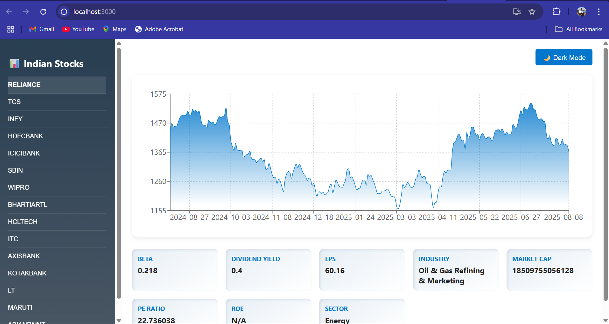
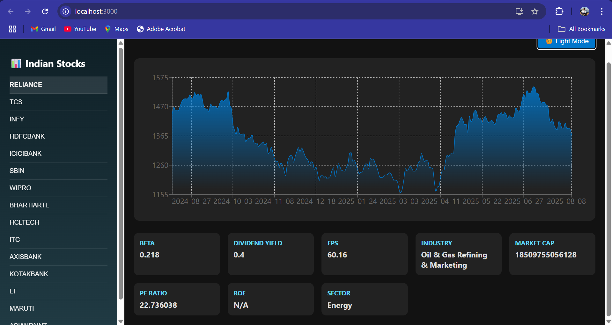

# 📊 Stock Dashboard Web Application

A **full-stack stock market dashboard** that displays **real-time and historical stock data** for 30+ major Indian companies.  
It features **interactive charts**, detailed **financial metrics** like Market Cap, PE Ratio, EPS, Beta, Sector, and more, with **Light/Dark mode** support.

---

## 🚀 Features
- 📈 **Interactive Price Charts** – 1-Year historical data with smooth gradient styling.
- 💹 **Key Financial Metrics** – Market Cap, PE Ratio, Dividend Yield, ROE, EPS, Beta, etc.
- 🌗 **Light/Dark Mode Toggle** – Switch seamlessly between themes.
- 📋 **Sidebar with 30+ Indian Companies** – Quick navigation for switching stocks.
- 🎨 **Modern, Responsive, and Elegant UI** – Works across devices.
- ⚡ **Fast Backend API** – Built with Flask and `yfinance`.

---

## 🖼 Screenshots

### **Light Mode**

### **Dark Mode**

---

## 🛠 Technologies Used

### **Frontend**
- **React.js** – Component-based UI.
- **Recharts** – For chart visualizations.
- **Axios** – API requests.
- **CSS3** – Custom styling with gradient charts and responsive layout.

### **Backend**
- **Python (Flask)** – REST API.
- **yfinance** – Live market data fetching.
- **Pandas & NumPy** – Data processing and transformation.

---

## 📂 Project Structure

stock-dashboard-project/  
│── backend/  
│ ├── server.py  
│ ├── fetch_stock.py  
│ └── requirements.txt  
│  
│── frontend/  
│ ├── src/  
│ │ ├── App.js  
│ │ ├── App.css  
│ │ └── index.js  
│ └── package.json  
│  
│── screenshots/  
│ ├── light-mode.png  
│ ├── dark-mode.png  
│  
│── README.md  

## 📊 Sample API Response

The backend fetches live data from **Yahoo Finance**.

Example response:

`json

{

  "dates": ["2024-08-10", "2024-08-11", "..."],
  
  "prices": [1450.25, 1462.10, "..."],
  
  "details": {
  
    "Market Cap": "18,509,755,056,128",
    
    "PE Ratio": "22.73",
    
    "Dividend Yield": "0.4",
    
    "EPS": "60.16",
    
    "Beta": "0.218",
    
    "Sector": "Energy",
    
    "Industry": "Oil & Gas Refining & Marketing"
    
  }
  
}

## **🛠 Installation & Setup**

**Backend**

cd backend

pip install -r requirements.txt

python server.py

**Frontend**

cd frontend

npm install

npm start

**Access the app at:**

Frontend → http://localhost:3000

Backend → http://localhost:5000

## **📜 Development Approach**

The project follows a modular full-stack architecture:

Backend (Flask) – Fetches and processes stock data using yfinance, then serves it through REST APIs.

Frontend (React) – Consumes the API via Axios, renders charts with Recharts, and displays financial details in a clean, responsive UI.

Added Light/Dark mode for accessibility and customization.

## **⚠ Challenges Faced**

Yahoo Finance API delays and missing fields for some companies.

Formatting financial metrics for readability.

Designing a chart that is visually appealing in both dark and light modes.

Efficiently managing React state to ensure smooth UI updates.

## **📎 Deliverables**

✅ Complete Source Code (Frontend + Backend)

✅ Live API Data Fetching

✅ Screenshots (Light & Dark Mode)

✅ README with setup instructions, technologies, and challenges

## **📌 Future Enhancements**

🔍 Search functionality for any NSE-listed company.

📊 Candlestick chart toggle option.

📰 News feed and sentiment analysis for selected companies.
